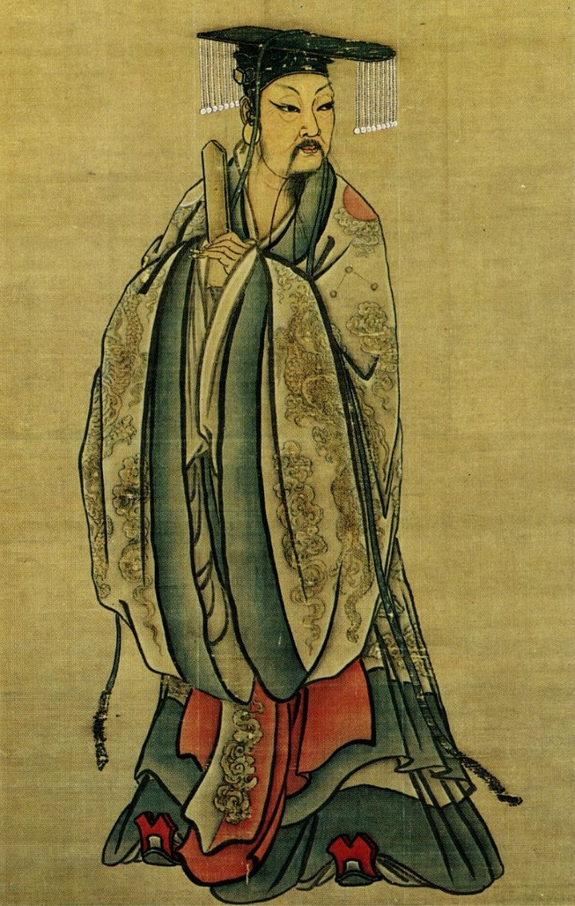

# 本纪 夏本纪

---

夏禹，名曰文命。禹之父曰鲧，鲧之父曰帝颛顼，颛顼之父曰昌意，昌意之父曰黄帝。禹者，黄帝之玄孙而帝颛顼之孙也。禹之曾大父昌意及父鲧皆不得在帝位，为人臣。

---

当帝尧之时，鸿水滔天，浩浩怀山襄陵，下民其忧。尧求能治水者，群臣四岳皆曰鲧可。尧曰： __「鲧为人负命毁族，不可。」__ 四岳曰： __「等之未有贤于鲧者，愿帝试之。」__ 于是尧听四岳，用鲧治水。九年而水不息，功用不成。于是帝尧乃求人，更得舜。舜登用，摄行天子之政，巡狩。行视鲧之治水无状，乃殛鲧于羽山以死。天下皆以舜之诛为是。于是舜举鲧子禹，而使续鲧之业。

---

尧崩，帝舜问四岳曰： __「有能成美尧之事者使居官？」__ 皆曰： __「伯禹为司空，可成美尧之功。」__ 舜曰： __「嗟，然！」__ 命禹： __「女平水土，维是勉之。」__ 禹拜稽首，让于契、后稷、皋陶。舜曰： __「女其往视尔事矣。」__

---

禹为人敏给克勤；其德不违，其仁可亲，其言可信；声为律，身为度，称以出；亹亹穆穆，为纲为纪。

---

禹乃遂与益、后稷奉帝命，命诸侯百姓兴人徒以傅土，行山表木，定高山大川。禹伤先人父鲧功之不成受诛，乃劳身焦思，居外十三年，过家门不敢入。薄衣食，致孝于鬼神。卑宫室，致费于沟淢。陆行乘车，水行乘船，泥行乘橇，山行乘檋。左准绳，右规矩，载四时，以开九州，通九道，陂九泽，度九山。令益予众庶稻，可种卑湿。命后稷予众庶难得之食。食少，调有馀相给，以均诸侯。禹乃行相地宜所有以贡，及山川之便利。

---

禹行自冀州始。冀州：既载壶口，治梁及岐。既修太原，至于岳阳。覃怀致功，至于衡漳。其土白壤。赋上上错，田中中，常、卫既从，大陆既为。鸟夷皮服。夹右碣石，入于海。

---

济、河维沇州：九河既道，雷夏既泽，雍、沮会同，桑土既蚕，于是民得下丘居土。其土黑坟，草繇木条。田中下，赋贞，作十有三年乃同。其贡漆丝，其篚织文。浮于济、漯，通于河。

---

海岱维青州：堣夷既略，潍、淄其道。其土白坟，海滨广舄，厥田斥卤。田上下，赋中上。厥贡盐絺，海物维错，岱畎丝、枲、铅、松、怪石，莱夷为牧，其篚酓丝。浮于汶，通于济。

---

海岱及淮维徐州：淮、沂其治，蒙、羽其艺。大野既都，东原底平。其土赤埴坟，草木渐包。其田上中，赋中中。贡维土五色，羽畎夏狄，峄阳孤桐，泗滨浮磬，淮夷蠙珠臮鱼，其篚玄纤缟。浮于淮、泗，通于河。

---

淮海维扬州：彭蠡既都，阳鸟所居。三江既入，震泽致定。竹箭既布。其草惟夭，其木惟乔，其土涂泥。田下下，赋下上上杂。贡金三品，瑶、琨、竹箭，齿、革、羽、旄，岛夷卉服，其篚织贝，其包橘、柚锡贡。均江海，通淮、泗。

---

荆及衡阳维荆州：江、汉朝宗于海。九江甚中，沱、涔已道，云土、梦为治。其土涂泥。田下中，赋上下。贡羽、旄、齿、革，金三品，杶、干、栝、柏，砺、砥、砮、丹，维箘簬、楛，三国致贡其名，包匦菁茅，其篚玄纁玑组，九江入赐大龟。浮于江、沱、涔、（于）汉，逾于雒，至于南河。

---

荆河惟豫州：伊、雒、瀍、涧既入于河，荥播既都，道荷泽，被明都。其土壤，下土坟垆。田中上，赋杂上中。贡漆、丝、絺、紵，其篚纤絮，锡贡磬错。浮于雒，达于河。

---

华阳黑水惟梁州：汶、嶓既艺，沱、涔既道，蔡、蒙旅平，和夷砥绩。其土青骊。田下上，赋下中三错。贡璆、铁、银、镂、砮、磬，熊、罴、狐、狸、织皮。西倾因桓是来，浮于潜，逾于沔，入于渭，乱于河。

---

黑水西河惟雍州：弱水既西，泾属渭汭。漆、沮既从，沣水所同。荆、岐已旅，终南、敦物至于鸟鼠。原隰砥绩，至于都野。三危既度，三苗大序。其土黄壤。田上上，赋中下。贡璆、琳、琅玕。浮于积石，至于龙门西河，会于渭汭。织皮昆仑、析支、渠搜，西戎即序。

---

道九山：汧及岐至于荆山，逾于河；壶口、雷首至于太岳；砥柱、析城至于王屋；太行、常山至于碣石，入于海；西倾、朱圉、鸟鼠至于太华；熊耳、外方、桐柏至于负尾；道嶓冢，至于荆山；内方至于大别；汶山之阳至衡山，过九江，至于敷浅原。

---

道九川：弱水至于合黎，馀波入于流沙。道黑水，至于三危，入于南海。道河积石，至于龙门，南至华阴，东至砥柱，又东至于盟津，东过雒汭，至于大邳，北过降水，至于大陆，北播为九河，同为逆河，入于海。嶓冢道瀁，东流为汉，又东为苍浪之水，过三澨，入于大别，南入于江，东汇泽为彭蠡，东为北江，入于海。汶山道江，东别为沱，又东至于醴，过九江，至于东陵，东迤北会于汇，东为中江，入于梅。道沇水，东为济，入于河，泆为荥，东出陶丘北，又东至于荷，又东北会于汶，又东北入于海。道淮自桐柏，东会于泗、沂，东入于海。道渭自鸟鼠同穴，东会于沣，又东北至于泾，东过漆、沮，入于河。道雒自熊耳，东北会于涧、瀍，又东会于伊，东北入于河。

---

于是九州攸同，四奥既居，九山刊旅，九川涤原，九泽既陂，四海会同。六府甚修，众土交正，致慎财赋，咸则三壤成赋。中国赐土姓： __「祗台德先，不距朕行。」__

---

令天子之国以外五百里甸服：百里赋纳总，二百里纳銍，三百里纳秸服，四百里粟，五百里米。甸服外五百里侯服：百里采，二百里任国，三百里诸侯。侯服外五百里绥服：三百里揆文教，二百里奋武卫。绥服外五百里要服：三百里夷，二百里蔡。要服外五百里荒服：三百里蛮，二百里流。

---

东渐于海，西被于流沙，朔、南暨：声教讫于四海。于是帝锡禹玄圭，以告成功于天下。天下于是太平治。

---

皋陶作士以理民。帝舜朝，禹、伯夷、皋陶相与语帝前。皋陶述其谋曰： __「信其道德，谋明辅和。」__ 禹曰： __「然，如何？」__ 皋陶曰： __「于！慎其身修，思长，敦序九族，众明高翼，近可远在已。」__ 禹拜美言，曰： __「然。」__ 皋陶曰： __「于！在知人，在安民。」__ 禹曰： __「吁！皆若是，惟帝其难之。知人则智，能官人；能安民则惠，黎民怀之。能知能惠，何忧乎驩兜，何迁乎有苗，何畏乎巧言善色佞人？」__ 皋陶曰： __「然，于！亦行有九德，亦言其有德。」__ 乃言曰： __「始事事，宽而栗，柔而立，愿而共，治而敬，扰而毅，直而温，简而廉，刚而实，强而义，章其有常，吉哉。日宣三德，蚤夜翊明有家。日严振敬六德，亮采有国。翕受普施，九德咸事，俊乂在官，百吏肃谨。毋教邪淫奇谋。非其人居其官，是谓乱天事。天讨有罪，五刑五用哉。

---

吾言砥可行乎？」__ 禹曰： __「女言致可绩行。」__ 皋陶曰： __「余未有知，思赞道哉。」__

---

帝舜谓禹曰： __「女亦昌言。」__ 禹拜曰； __「于，予何言！予思日孳孳。」__ 皋陶难禹曰： __「何谓孳孳？」__ 禹曰： __「鸿水滔天，浩浩怀山襄陵，下民皆服于水。予陆行乘车，水行乘舟，泥行乘橇，山行乘檋，行山刊木。与益予众庶稻鲜食。以决九川致四海，浚畎浍致之川。与稷予众庶难得之食。食少，调有馀补不足，徙居。众民乃定，万国为治。」__ 皋陶曰： __「然，此而美也。」__

---

禹曰： __「于，帝！慎乃在位，安尔止。辅德，天下大应。清意以昭待上帝命，天其重命用休。」__ 帝曰： __「吁，臣哉，臣哉！臣作朕股肱耳目。予欲左右有民，女辅之。余欲观古人之象。日月星辰，作文绣服色，女明之。予欲闻六律五声八音，来始滑，以出入五言，女听。予即辟，女匡拂予。女无面谀。退而谤予。敬四辅臣。诸众谗嬖臣，君德诚施皆清矣。」__ 禹曰： __「然。帝即不时，布同善恶则毋功。」__

---

帝曰： __「毋若丹朱傲，维慢游是好，毋水行舟，朋淫于家，用绝其世。予不能顺是。」__ 禹曰： __「予（辛壬）娶涂山，［辛壬］癸甲，生启予不子，以故能成水土功。辅成五服，至于五千里，州十二师，外薄四海，咸建五长，各道有功。苗顽不即功，帝其念哉。」__ 帝曰： __「道吾德，乃女功序之也。」__

---

皋陶于是敬禹之德，令民皆则禹。不如言，刑从之。舜德大明。

---

于是夔行乐，祖考至，群后相让，鸟兽翔舞，箫韶九成，凤皇来仪，百兽率舞，百官信谐。帝用此作歌曰： __「陟天之命，维时维几。」__ 乃歌曰： __「股肱喜哉，元首起哉，百工熙哉！」__ 皋陶拜手稽首扬言曰： __「念哉，率为兴事，慎乃宪，敬哉！」__ 乃更为歌曰： __「元首明哉，股肱良哉，庶事康哉！」__ （舜）又歌曰： __「元首丛脞哉，股肱惰哉，万事堕哉！」__ 帝拜曰： __「然，往钦哉！」__ 于是天下皆宗禹之明度数声乐，为山川神主。

---

帝舜荐禹于天，为嗣。十七年而帝舜崩。三年丧毕，禹辞辟舜之子商均于阳城。天下诸侯皆去商均而朝禹。禹于是遂即天子位，南面朝天下，国号曰夏后，姓姒氏。

---

帝禹立而举皋陶荐之，且授政焉，而皋陶卒。封皋陶之后于英、六，或在许。而后举益，任之政。

---

十年，帝禹东巡狩，至于会稽而崩。以天下授益。三年之丧毕，益让帝禹之子启，而辟居箕山之阳。禹子启贤，天下属意焉。及禹崩，虽授益，益之佐禹日浅，天下未洽。故诸侯皆去益而朝启，曰： __「吾君帝禹之子也」__ 。于是启遂即天子之位，是为夏后帝启。

---

夏后帝启，禹之子，其母涂山氏之女也。

---

有扈氏不服，启伐之，大战于甘。将战，作甘誓，乃召六卿申之。启曰： __「嗟！六事之人，予誓告女：有扈氏威侮五行，怠弃三正，天用剿绝其命。今予维共行天之罚。左不攻于左，右不攻于右，女不共命。御非其马之政，女不共命。用命，赏于祖；不用命，僇于社，予则帑僇女。」__ 遂灭有扈氏。天下咸朝。

---

夏后帝启崩，子帝太康立。帝太康失国，昆弟五人，须于洛汭，作五子之歌。

---

太康崩，弟中康立，是为帝中康。帝中康时，羲、和湎淫，废时乱日。胤往征之，作胤征。

---

中康崩，子帝相立。帝相崩，子帝少康立。帝少康崩，子帝予立。帝予崩，子帝槐立。帝槐崩，子帝芒立。帝芒崩，子帝泄立。帝泄崩，子帝不降立。帝不降崩，弟帝扃立。帝扃崩，子帝廑立。帝廑崩，立帝不降之子孔甲，是为帝孔甲。帝孔甲立，好方鬼神，事淫乱。夏后氏德衰，诸侯畔之。天降龙二，有雌雄，孔甲不能食，未得豢龙氏。陶唐既衰，其后有刘累，学扰龙于豢龙氏，以事孔甲。孔甲赐之姓曰御龙氏，受豕韦之后。龙一雌死，以食夏后。夏后使求，惧而迁去。

---

孔甲崩，子帝皋立。帝皋崩，子帝发立。帝发崩，子帝履癸立，是为桀。帝桀之时，自孔甲以来而诸侯多畔夏，桀不务德而武伤百姓，百姓弗堪。乃召汤而囚之夏台，已而释之。汤修德，诸侯皆归汤，汤遂率兵以伐夏桀。桀走鸣条，遂放而死。桀谓人曰： __「吾悔不遂杀汤于夏台，使至此。」__ 汤乃践天子位，代夏朝天下。汤封夏之后，至周封于杞也。

---

太史公曰：禹为姒姓，其后分封，用国为姓，故有夏后氏、有扈氏、有男氏、斟寻氏、彤城氏、褒氏、费氏、杞氏、缯氏、辛氏、冥氏、斟（氏）戈氏。孔子正夏时，学者多传夏小正云。自虞、夏时，贡赋备矣。或言禹会诸侯江南，计功而崩，因葬焉，命曰会稽。会稽者，会计也。
