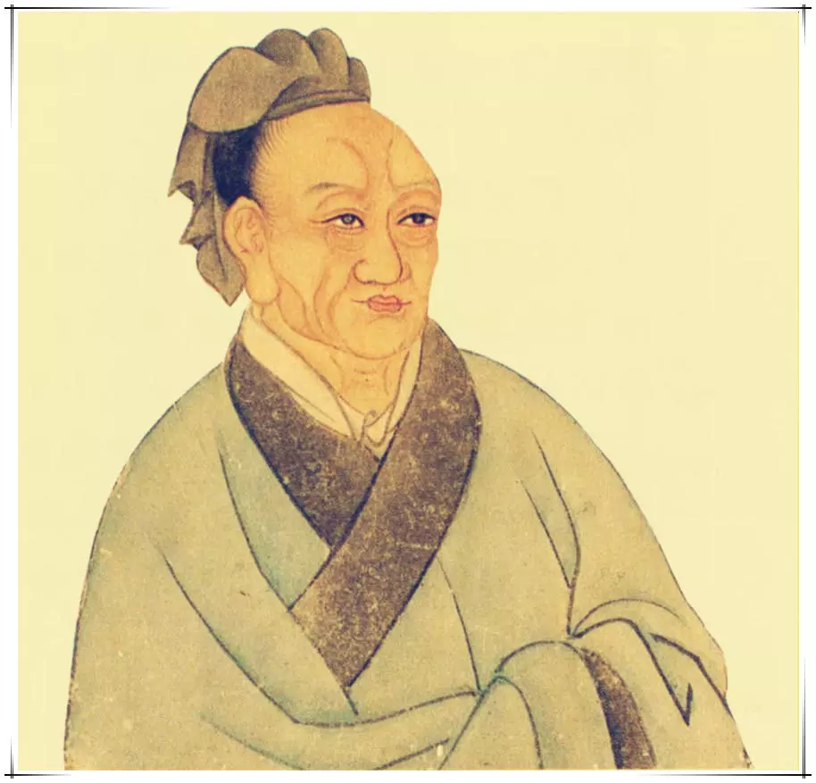

# 建元以来侯者年表

---

太史公曰：匈奴绝和亲攻当路塞；闽越擅伐东瓯请降。二夷交侵当盛汉之隆以此知功臣受封侔於祖考矣。何者？自《诗》、《书》称三代 __「戎狄是膺荆荼是征」__ 齐桓越燕伐山戎武灵王以区区赵服单于秦缪用百里霸西戎吴楚之君以诸侯役百越。况乃以中国一统明天子在上兼文武席卷四海内辑亿万之众岂以晏然不为连境征伐哉！自是後遂出师北讨强胡南诛劲越将卒以次封矣。

---

## （表略）

---

孝武之代天下多虞。南讨瓯越北击单于。长平鞠旅冠军前驱。术阳衔璧临蔡破禺。博6上宰平津巨儒。金章且佩紫绶行纡。昭帝已後勋宠不殊。惜哉绝笔褚氏补诸。