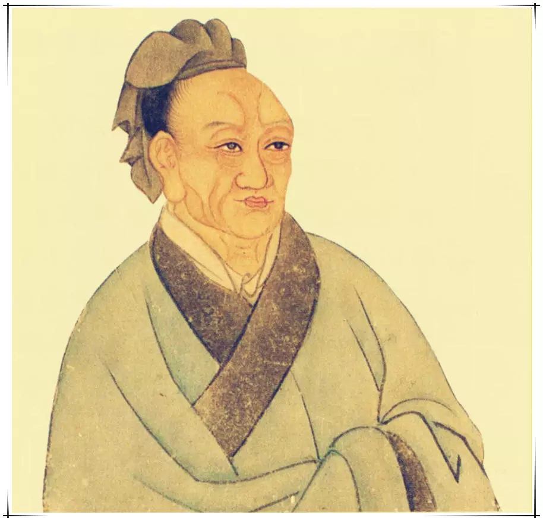

# 孔子世家

---

孔子生鲁昌平乡陬邑。其先宋人也曰孔防叔。防叔生伯夏伯夏生叔梁纥。纥与颜氏女野合而生孔子祷於尼丘得孔子。鲁襄公二十二年而孔子生。生而上圩顶故因名曰丘云。字仲尼姓孔氏。

---

丘生而叔梁纥死葬於防山。防山在鲁东由是孔子疑其父墓处母讳之也。孔子为兒嬉戏常陈俎豆设礼容。孔子母死乃殡五父之衢盖其慎也。郰人輓父之母诲孔子父墓然後往合葬於防焉。

---

孔子要绖季氏飨士孔子与往。阳虎绌曰： __「季氏飨士非敢飨子也。」__ 孔子由是退。

---

孔子年十七鲁大夫孟釐子病且死诫其嗣懿子曰： __「孔丘圣人之後灭於宋。其祖弗父何始有宋而嗣让厉公。及正考父佐戴、武、宣公三命兹益恭故鼎铭云： __「一命而偻再命而伛三命而俯循墙而走亦莫敢余侮。饘於是粥於是以餬余口。」__ 其恭如是。吾闻圣人之後虽不当世必有达者。今孔丘年少好礼其达者欤？吾即没若必师之。」__ 及釐子卒懿子与鲁人南宫敬叔往学礼焉。是岁季武子卒平子代立。

---

孔子贫且贱。及长尝为季氏史料量平；尝为司职吏而畜蕃息。由是为司空。已而去鲁斥乎齐逐乎宋、卫困於陈蔡之间於是反鲁。孔子长九尺有六寸人皆谓之 __「长人」__ 而异之。鲁复善待由是反鲁。

---

鲁南宫敬叔言鲁君曰： __「请与孔子適周。」__ 鲁君与之一乘车两马一竖子俱適周问礼盖见老子云。辞去而老子送之曰： __「吾闻富贵者送人以财仁人者送人以言。吾不能富贵窃仁人之号送子以言曰： __「聪明深察而近於死者好议人者也。博辩广大危其身者人之恶者也。为人子者毋以有己为人臣者毋以有己。」__ 」__ 孔子自周反于鲁弟子稍益进焉。

---

是时也晋平公淫六卿擅权东伐诸侯；楚灵王兵彊陵轹中国；齐大而近於鲁。鲁小弱附於楚则晋怒；附於晋则楚来伐；不备於齐齐师侵鲁。

---

鲁昭公之二十年而孔子盖年三十矣。齐景公与晏婴来適鲁景公问孔子曰： __「昔秦穆公国小处辟其霸何也？」__ 对曰： __「秦国虽小其志大；处虽辟行中正。身举五羖爵之大夫起累绁之中与语三日授之以政。以此取之虽王可也其霸小矣。」__ 景公说。

---

孔子年三十五而季平子与郈昭伯以斗鸡故得罪鲁昭公昭公率师击平子平子与孟氏、叔孙氏三家共攻昭公昭公师败奔於齐齐处昭公乾侯。其後顷之鲁乱。孔子適齐为高昭子家臣欲以通乎景公。与齐太师语乐闻韶音学之三月不知肉味齐人称之。

---

景公问政孔子孔子曰： __「君君臣臣父父子子。」__ 景公曰： __「善哉！信如君不君臣不臣父不父子不子虽有粟吾岂得而食诸！」__ 他日又复问政於孔子孔子曰： __「政在节财。」__ 景公说将欲以尼谿田封孔子。晏婴进曰： __「夫儒者滑稽而不可轨法；倨傲自顺不可以为下；崇丧遂哀破产厚葬不可以为俗；游说乞贷不可以为国。自大贤之息周室既衰礼乐缺有间。今孔子盛容饰繁登降之礼趋详之节累世不能殚其学当年不能究其礼。君欲用之以移齐俗非所以先细民也。」__ 後景公敬见孔子不问其礼。异日景公止孔子曰： __「奉子以季氏吾不能。」__ 以季孟之间待之。齐大夫欲害孔子孔子闻之。景公曰： __「吾老矣弗能用也。」__ 孔子遂行反乎鲁。

---

孔子年四十二鲁昭公卒於乾侯定公立。定公立五年夏季平子卒桓子嗣立。季桓子穿井得土缶中若羊问仲尼云 __「得狗」__ 。仲尼曰： __「以丘所闻羊也。丘闻之木石之怪夔、罔阆水之怪龙、罔象土之怪坟羊。」__ 

---

吴伐越堕会稽得骨节专车。吴使使问仲尼： __「骨何者最大？」__ 仲尼曰： __「禹致群神於会稽山防风氏後至禹杀而戮之其节专车此为大矣。」__ 吴客曰： __「谁为神？」__ 仲尼曰： __「山川之神足以纲纪天下其守为神社稷为公侯皆属於王者。」__ 客曰： __「防风何守？」__ 仲尼曰： __「汪罔氏之君守封、禺之山为釐姓。在虞、夏、商为汪罔於周为长翟今谓之大人。」__ 客曰： __「人长几何？」__ 仲尼曰： __「僬侥氏三尺短之至也。长者不过十之数之极也。」__ 於是吴客曰： __「善哉圣人！」__ 

---

桓子嬖臣曰仲梁怀与阳虎有隙。阳虎欲逐怀公山不狃止之。其秋怀益骄阳虎执怀。桓子怒阳虎因囚桓子与盟而醳之。阳虎由此益轻季氏。季氏亦僭於公室陪臣执国政是以鲁自大夫以下皆僭离於正道。故孔子不仕退而脩诗书礼乐弟子弥众至自远方莫不受业焉。

---

定公八年公山不狃不得意於季氏因阳虎为乱欲废三桓之適更立其庶孽阳虎素所善者遂执季桓子。桓子诈之得脱。定公九年阳虎不胜奔于齐。是时孔子年五十。

---

公山不狃以费畔季氏使人召孔子。孔子循道弥久温温无所试莫能己用曰： __「盖周文武起丰镐而王今费虽小傥庶几乎！」__ 欲往。子路不说止孔子。孔子曰： __「夫召我者岂徒哉？如用我其为东周乎！」__ 然亦卒不行。

---

其後定公以孔子为中都宰一年四方皆则之。由中都宰为司空由司空为大司寇。

---

定公十年春及齐平。夏齐大夫黎鉏言於景公曰： __「鲁用孔丘其势危齐。」__ 乃使使告鲁为好会会於夹谷。鲁定公且以乘车好往。孔子摄相事曰： __「臣闻有文事者必有武备有武事者必有文备。古者诸侯出疆必具官以从。请具左右司马。」__ 定公曰： __「诺。」__ 具左右司马。会齐侯夹谷为坛位土阶三等以会遇之礼相见揖让而登。献酬之礼毕齐有司趋而进曰： __「请奏四方之乐。」__ 景公曰： __「诺。」__ 於是旍旄羽袚矛戟剑拨鼓噪而至。孔子趋而进历阶而登不尽一等举袂而言曰： __「吾两君为好会夷狄之乐何为於此！请命有司！」__ 有司卻之不去则左右视晏子与景公。景公心怍麾而去之。有顷齐有司趋而进曰： __「请奏宫中之乐。」__ 景公曰： __「诺。」__ 优倡侏儒为戏而前。孔子趋而进历阶而登不尽一等曰： __「匹夫而营惑诸侯者罪当诛！请命有司！」__ 有司加法焉手足异处。

---

景公惧而动知义不若归而大恐告其群臣曰： __「鲁以君子之道辅其君而子独以夷狄之道教寡人使得罪於鲁君为之柰何？」__ 有司进对曰： __「君子有过则谢以质小人有过则谢以文。君若悼之则谢以质。」__ 於是齐侯乃归所侵鲁之郓、汶阳、龟阴之田以谢过。

---

定公十三年夏孔子言於定公曰： __「臣无藏甲大夫毋百雉之城。」__ 使仲由为季氏宰将堕三都。於是叔孙氏先堕郈。季氏将堕费公山不狃、叔孙辄率费人袭鲁。公与三子入于季氏之宫登武子之台。费人攻之弗克入及公侧。孔子命申句须、乐颀下伐之费人北。国人追之败诸姑蔑。二子奔齐遂堕费。将堕成公敛处父谓孟孙曰： __「堕成齐人必至于北门。且成孟氏之保鄣无成是无孟氏也。我将弗堕。」__ 十二月公围成弗克。

---

定公十四年孔子年五十六由大司寇行摄相事有喜色。门人曰： __「闻君子祸至不惧福至不喜。」__ 孔子曰： __「有是言也。不曰 __「乐其以贵下人」__ 乎？」__ 於是诛鲁大夫乱政者少正卯。与闻国政三月粥羔豚者弗饰贾；男女行者别於涂；涂不拾遗；四方之客至乎邑者不求有司皆予之以归。

---

齐人闻而惧曰： __「孔子为政必霸霸则吾地近焉我之为先并矣。盍致地焉？」__ 黎鉏曰： __「请先尝沮之；沮之而不可则致地庸迟乎！」__ 於是选齐国中女子好者八十人皆衣文衣而舞康乐文马三十驷遗鲁君。陈女乐文马於鲁城南高门外季桓子微服往观再三将受乃语鲁君为周道游往观终日怠於政事。子路曰： __「夫子可以行矣。」__ 孔子曰： __「鲁今且郊如致膰乎大夫则吾犹可以止。」__ 桓子卒受齐女乐三日不听政；郊又不致膰俎於大夫。孔子遂行宿乎屯。而师己送曰： __「夫子则非罪。」__ 孔子曰： __「吾歌可夫？」__ 歌曰： __「彼妇之口可以出走；彼妇之谒可以死败。盖优哉游哉维以卒岁！」__ 师己反桓子曰： __「孔子亦何言？」__ 师己以实告。桓子喟然叹曰： __「夫子罪我以群婢故也夫！」__ 

---

孔子遂適卫主於子路妻兄颜浊邹家。卫灵公问孔子： __「居鲁得禄几何？」__ 对曰： __「奉粟六万。」__ 卫人亦致粟六万。居顷之或谮孔子於卫灵公。灵公使公孙余假一出一入。孔子恐获罪焉居十月去卫。

---

将適陈过匡颜刻为仆以其策指之曰： __「昔吾入此由彼缺也。」__ 匡人闻之以为鲁之阳虎。阳虎尝暴匡人匡人於是遂止孔子。孔子状类阳虎拘焉五日颜渊後子曰： __「吾以汝为死矣。」__ 颜渊曰： __「子在回何敢死！」__ 匡人拘孔子益急弟子惧。孔子曰： __「文王既没文不在兹乎？天之将丧斯文也後死者不得与于斯文也。天之未丧斯文也匡人其如予何！」__ 孔子使从者为甯武子臣於卫然後得去。

---

去即过蒲。月馀反乎卫主蘧伯玉家。灵公夫人有南子者使人谓孔子曰： __「四方之君子不辱欲与寡君为兄弟者必见寡小君。寡小君原见。」__ 孔子辞谢不得已而见之。夫人在絺帷中。孔子入门北面稽。夫人自帷中再拜环珮玉声璆然。孔子曰： __「吾乡为弗见见之礼答焉。」__ 子路不说。孔子矢之曰： __「予所不者天厌之！天厌之！」__ 居卫月馀灵公与夫人同车宦者雍渠参乘出使孔子为次乘招摇巿过之。孔子曰： __「吾未见好德如好色者也。」__ 於是丑之去卫过曹。是岁鲁定公卒。

---

孔子去曹適宋与弟子习礼大树下。宋司马桓魋欲杀孔子拔其树。孔子去。弟子曰： __「可以矣。」__ 孔子曰： __「天生德於予桓魋其如予何！」__ 

---

孔子適郑与弟子相失孔子独立郭东门。郑人或谓子贡曰： __「东门有人其颡似尧其项类皋陶其肩类子产然自要以下不及禹三寸。累累若丧家之狗。」__ 子贡以实告孔子。孔子欣然笑曰： __「形状末也。而谓似丧家之狗然哉！然哉！」__ 

---

孔子遂至陈主於司城贞子家。岁馀吴王夫差伐陈取三邑而去。赵鞅伐朝歌。楚围蔡蔡迁于吴。吴败越王句践会稽。

---

有隼集于陈廷而死楛矢贯之石砮矢长尺有咫。陈湣公使使问仲尼。仲尼曰： __「隼来远矣此肃慎之矢也。昔武王克商通道九夷百蛮使各以其方贿来贡使无忘职业。於是肃慎贡楛矢石砮长尺有咫。先王欲昭其令德以肃慎矢分大姬配虞胡公而封诸陈。分同姓以珍玉展亲；分异姓以远职使无忘服。故分陈以肃慎矢。」__ 试求之故府果得之。

---

孔子居陈三岁会晋楚争彊更伐陈及吴侵陈陈常被寇。孔子曰： __「归与归与！吾党之小子狂简进取不忘其初。」__ 於是孔子去陈。

---

过蒲会公叔氏以蒲畔蒲人止孔子。弟子有公良孺者以私车五乘从孔子。其为人长贤有勇力谓曰： __「吾昔从夫子遇难於匡今又遇难於此命也已。吾与夫子再罹难宁斗而死。」__ 斗甚疾。蒲人惧谓孔子曰： __「苟毋適卫吾出子。」__ 与之盟出孔子东门。孔子遂適卫。子贡曰： __「盟可负邪？」__ 孔子曰： __「要盟也神不听。」__ 

---

卫灵公闻孔子来喜郊迎。问曰： __「蒲可伐乎？」__ 对曰： __「可。」__ 灵公曰： __「吾大夫以为不可。今蒲卫之所以待晋楚也以卫伐之无乃不可乎？」__ 孔子曰： __「其男子有死之志妇人有保西河之志。吾所伐者不过四五人。」__ 灵公曰： __「善。」__ 然不伐蒲。

---

灵公老怠於政不用孔子。孔子喟然叹曰： __「苟有用我者期月而已三年有成。」__ 孔子行。

---

佛肸为中牟宰。赵简子攻范、中行伐中牟。佛肸畔使人召孔子。孔子欲往。子路曰： __「由闻诸夫子 __「其身亲为不善者君子不入也」__ 。今佛肸亲以中牟畔子欲往如之何？」__ 孔子曰： __「有是言也。不曰坚乎磨而不磷；不曰白乎涅而不淄。我岂匏瓜也哉焉能系而不食？」__ 

---

孔子击磬。有荷蒉而过门者曰： __「有心哉击磬乎！硜々乎莫己知也夫而已矣！」__ 

---

孔子学鼓琴师襄子十日不进。师襄子曰： __「可以益矣。」__ 孔子曰： __「丘已习其曲矣未得其数也。」__ 有间曰： __「已习其数可以益矣。」__ 孔子曰： __「丘未得其志也。」__ 有间曰： __「已习其志可以益矣。」__ 孔子曰： __「丘未得其为人也。」__ 有间有所穆然深思焉有所怡然高望而远志焉。曰： __「丘得其为人黯然而黑几然而长眼如望羊如王四国非文王其谁能为此也！」__ 师襄子辟席再拜曰： __「师盖云文王操也。」__ 

---

孔子既不得用於卫将西见赵简子。至於河而闻窦鸣犊、舜华之死也临河而叹曰： __「美哉水洋洋乎！丘之不济此命也夫！」__ 子贡趋而进曰： __「敢问何谓也？」__ 孔子曰： __「窦鸣犊舜华晋国之贤大夫也。赵简子未得志之时须此两人而后从政；及其已得志杀之乃从政。丘闻之也刳胎杀夭则麒麟不至郊竭泽涸渔则蛟龙不合阴阳覆巢毁卵则凤皇不翔。何则？君子讳伤其类也。夫鸟兽之於不义也尚知辟之而况乎丘哉！」__ 乃还息乎陬乡作为陬操以哀之。而反乎卫入主蘧伯玉家。

---

他日灵公问兵陈。孔子曰： __「俎豆之事则尝闻之军旅之事未之学也。」__ 明日与孔子语见蜚雁仰视之色不在孔子。孔子遂行复如陈。

---

夏卫灵公卒立孙辄是为卫出公。六月赵鞅内太子蒯聩于戚。阳虎使太子絻八人衰绖伪自卫迎者哭而入遂居焉。冬蔡迁于州来。是岁鲁哀公三年而孔子年六十矣。齐助卫围戚以卫太子蒯聩在故也。

---

夏鲁桓釐庙燔南宫敬叔救火。孔子在陈闻之曰： __「灾必於桓釐庙乎？」__ 已而果然。

---

秋季桓子病辇而见鲁城喟然叹曰： __「昔此国几兴矣以吾获罪於孔子故不兴也。」__ 顾谓其嗣康子曰： __「我即死若必相鲁；相鲁必召仲尼。」__ 後数日桓子卒康子代立。已葬欲召仲尼。公之鱼曰： __「昔吾先君用之不终终为诸侯笑。今又用之不能终是再为诸侯笑。」__ 康子曰： __「则谁召而可？」__ 曰： __「必召厓求。」__ 於是使使召厓求。厓求将行孔子曰： __「鲁人召求非小用之将大用之也。」__ 是日孔子曰： __「归乎归乎！吾党之小子狂简斐然成章吾不知所以裁之。」__ 子赣知孔子思归送厓求因诫曰 __「即用以孔子为招」__ 云。

---

厓求既去明年孔子自陈迁于蔡。蔡昭公将如吴吴召之也。前昭公欺其臣迁州来後将往大夫惧复迁公孙翩射杀昭公。楚侵蔡。秋齐景公卒。

---

明年孔子自蔡如叶。叶公问政孔子曰： __「政在来远附迩。」__ 他日叶公问孔子於子路子路不对。孔子闻之曰： __「由尔何不对曰 __「其为人也学道不倦诲人不厌愤忘食乐以忘忧不知老之将至」__ 云尔。」__ 

---

去叶反于蔡。长沮、桀溺耦而耕孔子以为隐者使子路问津焉。长沮曰： __「彼执舆者为谁？」__ 子路曰： __「为孔丘。」__ 曰： __「是鲁孔丘与？」__ 曰： __「然。」__ 曰： __「是知津矣。」__ 桀溺谓子路曰： __「子为谁？」__ 曰： __「为仲由。」__ 曰： __「子孔丘之徒与？」__ 曰： __「然。」__ 桀溺曰： __「悠悠者天下皆是也而谁以易之？且与其从辟人之士岂若从辟世之士哉！」__ 櫌而不辍。子路以告孔子孔子怃然曰： __「鸟兽不可与同群。天下有道丘不与易也。」__ 

---

他日子路行遇荷?丈人曰： __「子见夫子乎？」__ 丈人曰： __「四体不勤五穀不分孰为夫子！」__ 植其杖而芸。子路以告孔子曰： __「隐者也。」__ 复往则亡。

---

孔子迁于蔡三岁吴伐陈。楚救陈军于城父。闻孔子在陈蔡之间楚使人聘孔子。孔子将往拜礼陈蔡大夫谋曰： __「孔子贤者所刺讥皆中诸侯之疾。今者久留陈蔡之间诸大夫所设行皆非仲尼之意。今楚大国也来聘孔子。孔子用於楚则陈蔡用事大夫危矣。」__ 於是乃相与徒役围孔子於野。不得行绝粮。从者病莫能兴。孔子讲诵弦歌不衰。子路愠见曰： __「君子亦有穷乎？」__ 孔子曰： __「君子固穷小人穷斯滥矣。」__ 

---

子贡色作。孔子曰： __「赐尔以予为多学而识之者与？」__ 曰： __「然。非与？」__ 孔子曰： __「非也。予一以贯之。」__ 

---

孔子知弟子有愠心乃召子路而问曰： __「诗云 __「匪兕匪虎率彼旷野」__ 。吾道非邪？吾何为於此？」__ 子路曰： __「意者吾未仁邪？人之不我信也。意者吾未知邪？人之不我行也。」__ 孔子曰： __「有是乎！由譬使仁者而必信安有伯夷、叔齐？使知者而必行安有王子比干？」__ 

---

子路出子贡入见。孔子曰： __「赐诗云 __「匪兕匪虎率彼旷野」__ 。吾道非邪？吾何为於此？」__ 子贡曰： __「夫子之道至大也故天下莫能容夫子。夫子盖少贬焉？」__ 孔子曰： __「赐良农能稼而不能为穑良工能巧而不能为顺。君子能脩其道纲而纪之统而理之而不能为容。今尔不脩尔道而求为容。赐而志不远矣！」__ 

---

子贡出颜回入见。孔子曰： __「回诗云 __「匪兕匪虎率彼旷野」__ 。吾道非邪？吾何为於此？」__ 颜回曰： __「夫子之道至大故天下莫能容。虽然夫子推而行之不容何病不容然後见君子！夫道之不脩也是吾丑也。夫道既已大脩而不用是有国者之丑也。不容何病不容然後见君子！」__ 孔子欣然而笑曰： __「有是哉颜氏之子！使尔多财吾为尔宰。」__ 

---

於是使子贡至楚。楚昭王兴师迎孔子然後得免。

---

昭王将以书社地七百里封孔子。楚令尹子西曰： __「王之使使诸侯有如子贡者乎？」__ 曰： __「无有。」__  __「王之辅相有如颜回者乎？」__ 曰： __「无有。」__  __「王之将率有如子路者乎？」__ 曰： __「无有。」__  __「王之官尹有如宰予者乎？」__ 曰： __「无有。」__  __「且楚之祖封於周号为子男五十里。今孔丘述三五之法明周召之业王若用之则楚安得世世堂堂方数千里乎？夫文王在丰武王在镐百里之君卒王天下。今孔丘得据土壤贤弟子为佐非楚之福也。」__ 昭王乃止。其秋楚昭王卒于城父。

---

楚狂接舆歌而过孔子曰： __「凤兮凤兮何德之衰！往者不可谏兮来者犹可追也！已而已而今之从政者殆而！」__ 孔子下欲与之言。趋而去弗得与之言。

---

於是孔子自楚反乎卫。是岁也孔子年六十三而鲁哀公六年也。

---

其明年吴与鲁会缯徵百牢。太宰嚭召季康子。康子使子贡往然後得已。

---

孔子曰： __「鲁卫之政兄弟也。」__ 是时卫君辄父不得立在外诸侯数以为让。而孔子弟子多仕於卫卫君欲得孔子为政。子路曰： __「卫君待子而为政子将奚先？」__ 孔子曰： __「必也正名乎！」__ 子路曰： __「有是哉子之迂也！何其正也？」__ 孔子曰： __「野哉由也！夫名不正则言不顺言不顺则事不成事不成则礼乐不兴礼乐不兴则刑罚不中刑罚不中则民无所错手足矣。夫君子为之必可名言之必可行。君子於其言无所苟而已矣。」__ 

---

其明年厓有为季氏将师与齐战於郎克之。季康子曰： __「子之於军旅学之乎？性之乎？」__ 厓有曰： __「学之於孔子。」__ 季康子曰： __「孔子何如人哉？」__ 对曰： __「用之有名；播之百姓质诸鬼神而无憾。求之至於此道虽累千社夫子不利也。」__ 康子曰： __「我欲召之可乎？」__ 对曰： __「欲召之则毋以小人固之则可矣。」__ 而卫孔文子将攻太叔问策於仲尼。仲尼辞不知退而命载而行曰： __「鸟能择木木岂能择鸟乎！」__ 文子固止。会季康子逐公华、公宾、公林以币迎孔子孔子归鲁。

---

孔子之去鲁凡十四岁而反乎鲁。

---

鲁哀公问政对曰： __「政在选臣。」__ 季康子问政曰： __「举直错诸枉则枉者直。」__ 康子患盗孔子曰： __「苟子之不欲虽赏之不窃。」__ 然鲁终不能用孔子孔子亦不求仕。

---

孔子之时周室微而礼乐废诗书缺。追迹三代之礼序书传上纪唐虞之际下至秦缪编次其事。曰： __「夏礼吾能言之杞不足徵也。殷礼吾能言之宋不足徵也。足则吾能徵之矣。」__ 观殷夏所损益曰： __「後虽百世可知也以一文一质。周监二代郁郁乎文哉。吾从周。」__ 故书传、礼记自孔氏。

---

孔子语鲁大师： __「乐其可知也。始作翕如纵之纯如皦如绎如也以成。」__  __「吾自卫反鲁然後乐正雅颂各得其所。」__ 

---

古者诗三千馀篇及至孔子去其重取可施於礼义上采契后稷中述殷周之盛至幽厉之缺始於衽席故曰 __「关雎之乱以为风始鹿鸣为小雅始文王为大雅始清庙为颂始」__ 。三百五篇孔子皆弦歌之以求合韶武雅颂之音。礼乐自此可得而述以备王道成六艺。

---

孔子晚而喜易序彖、系、象、说卦、文言。读易韦编三绝。曰： __「假我数年若是我於易则彬彬矣。」__ 

---

孔子以诗书礼乐教弟子盖三千焉身通六艺者七十有二人。如颜浊邹之徒颇受业者甚众。

---

孔子以四教：文行忠信。绝四：毋意毋必毋固毋我。所慎：齐战疾。子罕言利与命与仁。不愤不启举一隅不以三隅反则弗复也。

---

其於乡党恂恂似不能言者。其於宗庙朝廷辩辩言唯谨尔。朝与上大夫言訚訚如也；与下大夫言侃侃如也。

---

入公门鞠躬如也；趋进翼如也。君召使儐色勃如也。君命召不俟驾行矣。

---

鱼馁肉败割不正不食。席不正不坐。食於有丧者之侧未尝饱也。

---

是日哭则不歌。见齐衰、瞽者虽童子必变。

---

 __「三人行必得我师。」__  __「德之不脩学之不讲闻义不能徙不善不能改是吾忧也。」__ 使人歌善则使复之然后和之。

---

子不语：怪力乱神。

---

子贡曰： __「夫子之文章可得闻也。夫子言天道与性命弗可得闻也已。」__ 颜渊喟然叹曰： __「仰之弥高钻之弥坚。瞻之在前忽焉在後。夫子循循然善诱人博我以文约我以礼欲罢不能。既竭我才如有所立卓尔。虽欲从之蔑由也已。」__ 达巷党人曰： __「大哉孔子博学而无所成名。」__ 子闻之曰： __「我何执？执御乎？执射乎？我执御矣。」__ 牢曰： __「子云 __「不试故艺」__ 。」__ 

---

鲁哀公十四年春狩大野。叔孙氏车子鉏商获兽以为不祥。仲尼视之曰： __「麟也。」__ 取之。曰： __「河不出图雒不出书吾已矣夫！」__ 颜渊死孔子曰： __「天丧予！」__ 及西狩见麟曰： __「吾道穷矣！」__ 喟然叹曰： __「莫知我夫！」__ 子贡曰： __「何为莫知子？」__ 子曰： __「不怨天不尤人下学而上达知我者其天乎！」__ 

---

 __「不降其志不辱其身伯夷、叔齐乎！」__ 谓 __「柳下惠、少连降志辱身矣」__ 。谓 __「虞仲、夷逸隐居放言行中清废中权」__ 。 __「我则异於是无可无不可。」__ 

---

子曰： __「弗乎弗乎君子病没世而名不称焉。吾道不行矣吾何以自见於後世哉？」__ 乃因史记作春秋上至隐公下讫哀公十四年十二公。据鲁亲周故殷运之三代。约其文辞而指博。故吴楚之君自称王而春秋贬之曰 __「子」__ ；践土之会实召周天子而春秋讳之曰 __「天王狩於河阳」__ ：推此类以绳当世。贬损之义後有王者举而开之。春秋之义行则天下乱臣贼子惧焉。

---

孔子在位听讼文辞有可与人共者弗独有也。至於为春秋笔则笔削则削子夏之徒不能赞一辞。弟子受春秋孔子曰： __「後世知丘者以春秋而罪丘者亦以春秋。」__ 

---

明岁子路死於卫。孔子病子贡请见。孔子方负杖逍遥於门曰： __「赐汝来何其晚也？」__ 孔子因叹歌曰： __「太山坏乎！梁柱摧乎！哲人萎乎！」__ 因以涕下。谓子贡曰： __「天下无道久矣莫能宗予。夏人殡於东阶周人於西阶殷人两柱间。昨暮予梦坐奠两柱之间予始殷人也。」__ 後七日卒。

---

孔子年七十三以鲁哀公十六年四月己丑卒。

---

哀公诔之曰： __「旻天不吊不玦遗一老俾屏余一人以在位茕茕余在疚。呜呼哀哉！尼父毋自律！」__ 子贡曰： __「君其不没於鲁乎！夫子之言曰： __「礼失则昏名失则愆。失志为昏失所为愆。」__ 生不能用死而诔之非礼也。称 __「余一人」__ 非名也。」__ 

---

孔子葬鲁城北泗上弟子皆服三年。三年心丧毕相诀而去则哭各复尽哀；或复留。唯子赣庐於冢上凡六年然後去。弟子及鲁人往从冢而家者百有馀室因命曰孔里。鲁世世相传以岁时奉祠孔子冢而诸儒亦讲礼乡饮大射於孔子冢。孔子冢大一顷。故所居堂弟子内後世因庙藏孔子衣冠琴车书至于汉二百馀年不绝。高皇帝过鲁以太牢祠焉。诸侯卿相至常先谒然後从政。

---

孔子生鲤字伯鱼。伯鱼年五十先孔子死。

---

伯鱼生伋字子思年六十二。尝困於宋。子思作中庸。

---

子思生白字子上年四十七。子上生求字子家年四十五。子家生箕字子京年四十六。子京生穿字子高年五十一。子高生子慎年五十七尝为魏相。

---

子慎生鲋年五十七为陈王涉博士死於陈下。

---

鲋弟子襄年五十七。尝为孝惠皇帝博士迁为长沙太守。长九尺六寸。

---

子襄生忠年五十七。忠生武武生延年及安国。安国为今皇帝博士至临淮太守蚤卒。安国生卬卬生驩。

---

太史公曰：诗有之： __「高山仰止景行行止。」__ 虽不能至然心乡往之。余读孔氏书想见其为人。適鲁观仲尼庙堂车服礼器诸生以时习礼其家余祗回留之不能去云。天下君王至于贤人众矣当时则荣没则已焉。孔子布衣传十馀世学者宗之。自天子王侯中国言六艺者折中於夫子可谓至圣矣！

---

孔子之胄出于商国。弗父能让正考铭勒。防叔来奔邹人掎足。尼丘诞圣阙里生德。七十升堂四方取则。卯诛两观摄相夹谷。歌凤遽衰泣麟何促！九流仰镜万古钦躅。