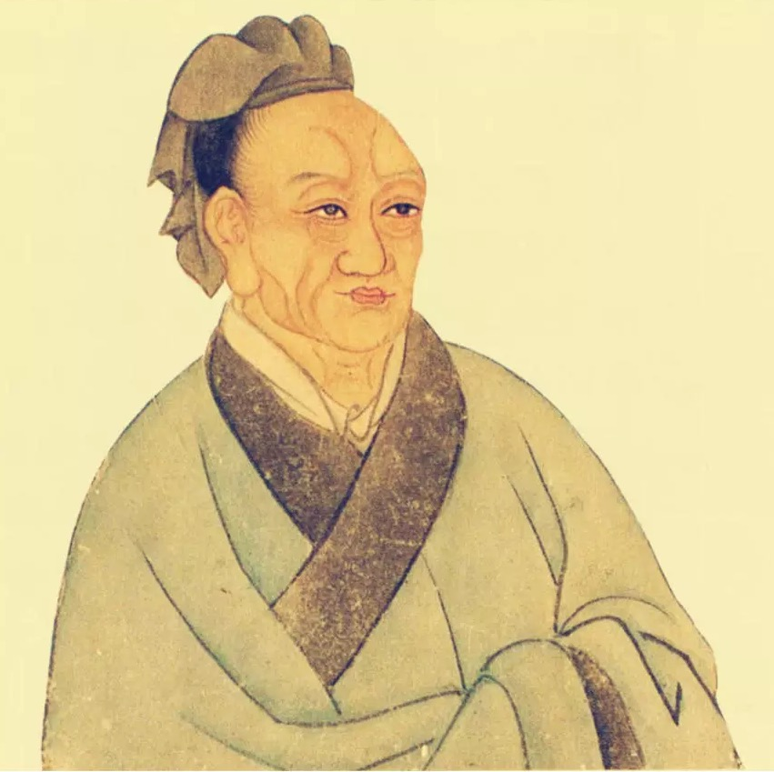

# 列传 司马穰苴列传

---

司马穰苴者，田完之苗裔也。齐景公时，晋伐阿、甄，而燕侵河上，齐师败绩。景公患之。晏婴乃荐田穰苴曰： __「穰苴虽田氏庶孽，然其人文能附众，武能威敌，愿君试之。」__ 景公召穰苴，与语兵事，大说之，以为将军，将兵捍燕晋之师。穰苴曰： __「臣素卑贱，君擢之闾伍之中，加之大夫之上，士卒未附，百姓不信，人微权轻，愿得君之宠臣，国之所尊，以监军，乃可。」__ 于是景公许之，使庄贾往。穰苴既辞，与庄贾约曰： __「旦日日中会于军门。」__ 穰苴先驰至军，立表下漏待贾。贾素骄贵，以为将己之军而己为监，不甚急；亲戚左右送之，留饮。日中而贾不至。穰苴则仆表决漏，入，行军勒兵，申明约束。约束既定，夕时，庄贾乃至。穰苴曰： __「何后期为？」__ 贾谢曰： __「不佞大夫亲戚送之，故留。」__

---

穰苴曰： __「将受命之日则忘其家，临军约束则忘其亲，援枹鼓之急则忘其身。今敌国深侵，邦内骚动，士卒暴露于境，君寝不安席，食不甘味，百姓之命皆悬于君，何谓相送乎！」__ 召军正问曰： __「军法期而后至者云何？」__ 对曰： __「当斩。」__ 庄贾惧，使人驰报景公，请救。既往，未及反，于是遂斩庄贾以徇三军。三军之士皆振栗。久之，景公遣使者持节赦贾，驰入军中。穰苴曰： __「将在军，君令有所不受。」__ 问军正曰： __「驰三军法何？」__ 正曰： __「当斩。」__ 使者大惧。穰苴曰： __「君之使不可杀之。」__ 乃斩其仆，车之左驸，马之左骖，以徇三军。遣使者还报，然后行。士卒次舍井灶饮食问疾医药，身自拊循之。悉取将军之资粮享士卒，身与士卒平分粮食。最比其羸弱者，三日而后勒兵。病者皆求行，争奋出为之赴战。晋师闻之，为罢去。

---

燕师闻之，度水而解。于是追击之，遂取所亡封内故境而引兵归。未至国，释兵旅，解约束，誓盟而后入邑。景公与诸大夫郊迎，劳师成礼，然后反归寝。既见穰苴，尊为大司马。田氏日以益尊于齐。

---

已而大夫鲍氏、高、国之属害之，谮于景公。景公退穰苴，苴发疾而死。田乞、田豹之徒由此怨高、国等。其后及田常杀简公，尽灭高子、国子之族。至常曾孙和，因自立为齐威王，用兵行威，大放穰苴之法，而诸侯朝齐。

---

齐威王使大夫追论古者司马兵法而附穰苴于其中，因号曰司马穰苴兵法。

---

> 太史公曰：余读司马兵法，闳廓深远，虽三代征伐，未能竟其义，如其文也，亦少褒矣。若夫穰苴，区区为小国行师，何暇及司马兵法之揖让乎？世既多司马兵法，以故不论，著穰苴之列传焉。