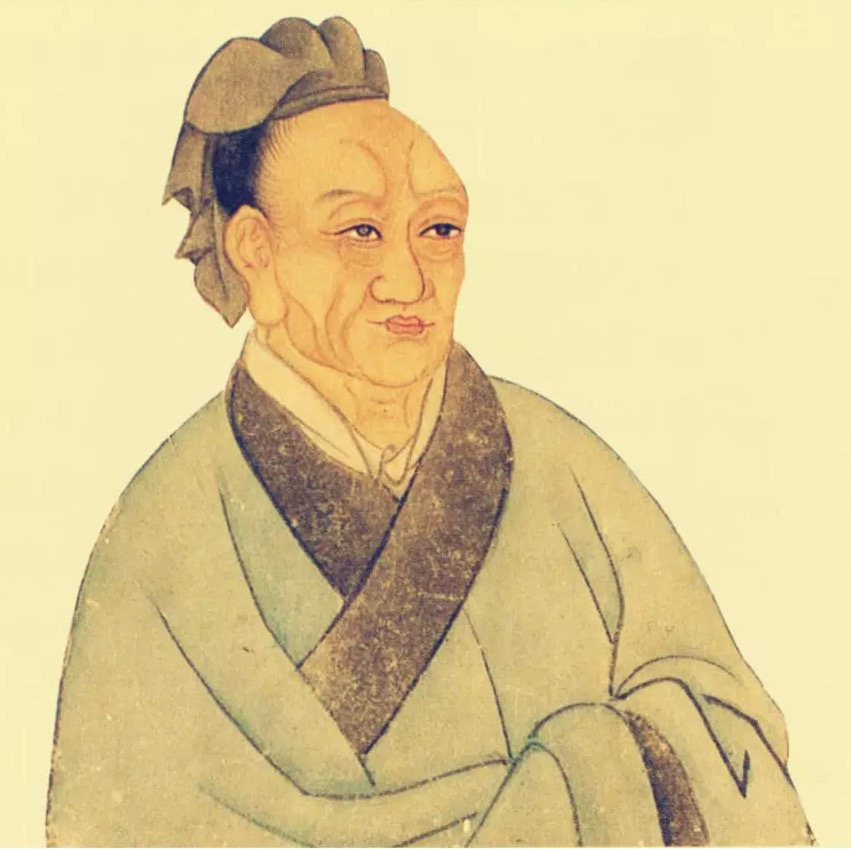

# 列传 滑稽列传

---

孔子曰： __「六艺于治一也。礼以节人，乐以发和，书以道事，诗以达意，易以神化，春秋以义。」__ 太史公曰：天道恢恢，岂不大哉！谈言微中，亦可以解纷。

---

淳于髡者，齐之赘婿也。长不满七尺，滑稽多辩，数使诸侯，未尝屈辱。齐威王之时喜隐，好为淫乐长夜之饮，沈湎不治，委政卿大夫。百官荒乱，诸侯并侵，国且危亡，在于旦暮，左右莫敢谏。淳于髡说之以隐曰： __「国中有大鸟，止王之庭，三年不蜚又不鸣，不知此鸟何也？」__ 王曰： __「此鸟不飞则已，一飞冲天；不鸣则已，一鸣惊人。」__ 于是乃朝诸县令长七十二人，赏一人，诛一人，奋兵而出。诸侯振惊，皆还齐侵地。威行三十六年。语在田完世家中。

---

威王八年，楚大发兵加齐。齐王使淳于髡之赵请救兵，赍金百斤，车马十驷。淳于髡仰天大笑，冠缨索绝。王曰： __「先生少之乎？」__ 髡曰： __「何敢！」__ 王曰： __「笑岂有说乎？」__ 髡曰： __「今者臣从东方来，见道傍有禳田者，操一豚蹄，酒一盂，祝曰：‘瓯窭满篝，污邪满车，五谷蕃熟，穰穰满家。’臣见其所持者狭而所欲者奢，故笑之。」__ 于是齐威王乃益赍黄金千溢，白璧十双，车马百驷。髡辞而行，至赵。赵王与之精兵十万，革车千乘。楚闻之，夜引兵而去。

---

威王大说，置酒后宫，召髡赐之酒。问曰： __「先生能饮几何而醉？」__ 对曰： __「臣饮一斗亦醉，一石亦醉。」__ 威王曰： __「先生饮一斗而醉，恶能饮一石哉！其说可得闻乎？」__ 髡曰： __「赐酒大王之前，执法在傍，御史在后，髡恐惧俯伏而饮，不过一斗径醉矣。若亲有严客，髡帣鞲鞠跽，待酒于前，时赐馀沥，奉觞上寿，数起，饮不过二斗径醉矣。若朋友交游，久不相见，卒然相睹，欢然道故，私情相语，饮可五六斗径醉矣。若乃州闾之会，男女杂坐，行酒稽留，六博投壶，相引为曹，握手无罚，目眙不禁，前有堕珥，后有遗簪，髡窃乐此，饮可八斗而醉二参。日暮酒阑，合尊促坐，男女同席，履舄交错，杯盘狼藉，堂上烛灭，主人留髡而送客，罗襦襟解，微闻芗泽，当此之时，髡心最欢，能饮一石。

---

故曰酒极则乱，乐极则悲；万事尽然，言不可极，极之而衰。」__ 以讽谏焉。齐王曰： __「善。」__ 乃罢长夜之饮，以髡为诸侯主客。宗室置酒，髡尝在侧。

---

其后百馀年，楚有优孟。

---

优孟，故楚之乐人也。长八尺，多辩，常以谈笑讽谏。楚庄王之时，有所爱马，衣以文绣，置之华屋之下，席以露床，啗以枣脯。马病肥死，使群臣丧之，欲以棺椁大夫礼葬之。左右争之，以为不可。王下令曰： __「有敢以马谏者，罪至死。」__ 优孟闻之，入殿门。仰天大哭。王惊而问其故。优孟曰： __「马者王之所爱也，以楚国堂堂之大，何求不得，而以大夫礼葬之，薄，请以人君礼葬之。」__ 王曰： __「何如？」__ 对曰： __「臣请以雕玉为棺，文梓为椁，楩枫豫章为题凑，发甲卒为穿圹，老弱负土，齐赵陪位于前，韩魏翼卫其后，庙食太牢，奉以万户之邑。诸侯闻之，皆知大王贱人而贵马也。」__ 王曰： __「寡人之过一至此乎！为之柰何？」__ 优孟曰： __「请为大王六畜葬之。以垄灶为椁，铜历为棺，赍以姜枣，荐以木兰，祭以粮稻，衣以火光，葬之于人腹肠。」__

---

于是王乃使以马属太官，无令天下久闻也。

---

楚相孙叔敖知其贤人也，善待之。病且死，属其子曰： __「我死，汝必贫困。若往见优孟，言我孙叔敖之子也。」__ 居数年，其子穷困负薪，逢优孟，与言曰： __「我，孙叔敖子也。父且死时，属我贫困往见优孟。」__ 优孟曰： __「若无远有所之。」__ 即为孙叔敖衣冠，抵掌谈语。岁馀，像孙叔敖，楚王及左右不能别也。庄王置酒，优孟前为寿。庄王大惊，以为孙叔敖复生也，欲以为相。优孟曰： __「请归与妇计之，三日而为相。」__ 庄王许之。三日后，优孟复来。王曰： __「妇言谓何？」__ 孟曰： __「妇言慎无为，楚相不足为也。如孙叔敖之为楚相，尽忠为廉以治楚，楚王得以霸。今死，其子无立锥之地，贫困负薪以自饮食。必如孙叔敖，不如自杀。」__ 因歌曰： __「山居耕田苦，难以得食。起而为吏，身贪鄙者馀财，不顾耻辱。

---

身死家室富，又恐受赇枉法，为奸触大罪，身死而家灭。贪吏安可为也！念为廉吏，奉法守职，竟死不敢为非。廉吏安可为也！楚相孙叔敖持廉至死，方今妻子穷困负薪而食，不足为也！」__ 于是庄王谢优孟，乃召孙叔敖子，封之寝丘四百户，以奉其祀。后十世不绝。此知可以言时矣。

---

其后二百馀年，秦有优旃。

---

优旃者，秦倡侏儒也。善为笑言，然合于大道，秦始皇时，置酒而天雨，陛楯者皆沾寒。优旃见而哀之，谓之曰： __「汝欲休乎？」__ 陛楯者皆曰： __「幸甚。」__ 优旃曰： __「我即呼汝，汝疾应曰诺。」__ 居有顷，殿上上寿呼万岁。优旃临槛大呼曰： __「陛楯郎！」__ 郎曰： __「诺。」__ 优旃曰： __「汝虽长，何益，幸雨立。我虽短也，幸休居。」__ 于是始皇使陛楯者得半相代。

---

始皇尝议欲大苑囿，东至函谷关，西至雍、陈仓。优旃曰： __「善。多纵禽兽于其中，寇从东方来，令麋鹿触之足矣。」__ 始皇以故辍止。

---

二世立，又欲漆其城。优旃曰： __「善。主上虽无言，臣固将请之。漆城虽于百姓愁费，然佳哉！漆城荡荡，寇来不能上。即欲就之，易为漆耳，顾难为荫室。」__ 于是二世笑之，以其故止。居无何，二世杀死，优旃归汉，数年而卒。

---

太史公曰：淳于髡仰天大笑，齐威王横行。优孟摇头而歌，负薪者以封。优旃临槛疾呼，陛楯得以半更。岂不亦伟哉！

---

褚先生曰：臣幸得以经术为郎，而好读外家传语。窃不逊让，复作故事滑稽之语六章，编之于左。可以览观扬意，以示后世好事者读之，以游心骇耳，以附益上方太史公之三章。

---

武帝时有所幸倡郭舍人者，发言陈辞虽不合大道，然令人主和说。武帝少时，东武侯母常养帝，帝壮时，号之曰 __「大乳母」__ 。率一月再朝。朝奏入，有诏使幸臣马游卿以帛五十匹赐乳母，又奉饮糒飱养乳母。乳母上书曰： __「某所有公田，愿得假倩之。」__ 帝曰： __「乳母欲得之乎？」__ 以赐乳母。乳母所言，未尝不听。有诏得令乳母乘车行驰道中。当此之时，公卿大臣皆敬重乳母。乳母家子孙奴从者横暴长安中，当道掣顿人车马，夺人衣服。闻于中，不忍致之法。有司请徙乳母家室，处之于边。奏可。乳母当入至前，面见辞。乳母先见郭舍人，为下泣。舍人曰： __「即入见辞去，疾步数还顾。」__ 乳母如其言，谢去，疾步数还顾。

---

郭舍人疾言骂之曰： __「咄！老女子！何不疾行！陛下已壮矣，宁尚须汝乳而活邪？尚何还顾！」__ 于是人主怜焉悲之，乃下诏止无徙乳母，罚谪谮之者。

---

武帝时，齐人有东方生名朔，以好古传书，爱经术，多所博观外家之语。朔初入长安，至公车上书，凡用三千奏牍。公车令两人共持举其书，仅然能胜之。人主从上方读之，止，辄乙其处，读之二月乃尽。诏拜以为郎，常在侧侍中。数召至前谈语，人主未尝不说也。时诏赐之食于前。饭已，尽怀其馀肉持去，衣尽污。数赐缣帛，檐揭而去。徒用所赐钱帛，取少妇于长安中好女。率取妇一岁所者即弃去，更取妇。所赐钱财尽索之于女子。人主左右诸郎半呼之 __「狂人」__ 。人主闻之，曰： __「令朔在事无为是行者，若等安能及之哉！」__ 朔任其子为郎，又为侍谒者，常持节出使。朔行殿中，郎谓之曰： __「人皆以先生为狂。」__ 朔曰： __「如朔等，所谓避世于朝廷闲者也。古之人，乃避世于深山中。」__ 时坐席中，酒酣，据地歌曰： __「陆沈于俗，避世金马门。

---

宫殿中可以避世全身，何必深山之中，蒿庐之下。」__ 金马门者，宦［者］署门也，门傍有铜马，故谓之曰 __「金马门」__ 。

---

时会聚宫下博士诸先生与论议，共难之曰： __「苏秦、张仪一当万乘之主，而都卿相之位，泽及后世。今子大夫修先王之术，慕圣人之义，讽诵诗书百家之言，不可胜数。著于竹帛，自以为海内无双，即可谓博闻辩智矣。然悉力尽忠以事圣帝，旷日持久，积数十年，官不过侍郎，位不过执戟，意者尚有遗行邪？其故何也？」__ 东方生曰： __「是固非子所能备也。彼一时也，此一时也，岂可同哉！夫张仪、苏秦之时，周室大坏，诸侯不朝，力政争权，相禽以兵，并为十二国，未有雌雄，得士者强，失士者亡，故说听行通，身处尊位，泽及后世，子孙长荣。今非然也。圣帝在上，德流天下，诸侯宾服，威振四夷，连四海之外以为席，安于覆盂，天下平均，合为一家，动发举事，犹如运之掌中。

---

贤与不肖，何以异哉？方今以天下之大，士民之众，竭精驰说，并进辐凑者，不可胜数。悉力慕义，困于衣食，或失门户。使张仪、苏秦与仆并生于今之世，曾不能得掌故，安敢望常侍侍郎乎！传曰：‘天下无害灾，虽有圣人，无所施其才；上下和同，虽有贤者，无所立功。’故曰时异则事异。虽然，安可以不务修身乎？《诗》曰：‘鼓钟于宫，声闻于外。鹤鸣九皋，声闻于天。’。茍能修身，何患不荣！太公躬行仁义七十二年，逢文王，得行其说，封于齐，七百岁而不绝。此士之所以日夜孜孜，修学行道，不敢止也。今世之处士，时虽不用，崛然独立，块然独处，上观许由，下察接舆，策同范蠡，忠合子胥，天下和平，与义相扶，寡偶少徒，固其常也。子何疑于余哉！」__ 于是诸先生默然无以应也。

---

建章宫后閤重栎中有物出焉，其状似麋。以闻，武帝往临视之。问左右群臣习事通经术者，莫能知。诏东方朔视之。朔曰： __「臣知之，愿赐美酒粱饭大飱臣，臣乃言。」__ 诏曰： __「可。」__ 已又曰： __「某所有公田鱼池蒲苇数顷，陛下以赐臣，臣朔乃言。」__ 诏曰： __「可。」__ 于是朔乃肯言，曰： __「所谓驺牙者也。远方当来归义，而驺牙先见。其齿前后若一，齐等无牙，故谓之驺牙。」__ 其后一岁所，匈奴混邪王果将十万众来降汉。乃复赐东方生钱财甚多。

---

至老，朔且死时，谏曰： __「《诗》云‘营营青蝇，止于蕃。恺悌君子，无信谗言。谗言罔极，交乱四国’。愿陛下远巧佞，退谗言。」__ 帝曰： __「今顾东方朔多善言？」__ 怪之。居无几何，朔果病死。传曰： __「鸟之将死，其鸣也哀；人之将死，其言也善。」__ 此之谓也。

---

武帝时，大将军卫青者，卫后兄也，封为长平侯。从军击匈奴，至余吾水上而还，斩首捕虏，有功来归，诏赐金千斤。将军出宫门，齐人东郭先生以方士待诏公车，当道遮卫将军车，拜谒曰： __「愿白事。」__ 将军止车前，东郭先生旁车言曰： __「王夫人新得幸于上，家贫。今将军得金千斤，诚以其半赐王夫人之亲，人主闻之必喜。此所谓奇策便计也。」__ 卫将军谢之曰： __「先生幸告之以便计，请奉教。」__ 于是卫将军乃以五百金为王夫人之亲寿。王夫人以闻武帝。帝曰： __「大将军不知为此。」__ 问之安所受计策，对曰： __「受之待诏者东郭先生。」__ 诏召东郭先生，拜以为郡都尉。东郭先生久待诏公车，贫困饥寒，衣敝，履不完。行雪中，履有上无下，足尽践地。

---

道中人笑之，东郭先生应之曰： __「谁能履行雪中，令人视之，其上履也，其履下处乃似人足者乎？」__ 及其拜为二千石，佩青緺出宫门，行谢主人。故所以同官待诏者，等比祖道于都门外。荣华道路，立名当世。此所谓衣褐怀宝者也。当其贫困时，人莫省视；至其贵也，乃争附之。谚曰： __「相马失之瘦，相士失之贫。」__ 其此之谓邪？

---

王夫人病甚，人主至自往问之曰： __「子当为王，欲安所置之？」__ 对曰： __「愿居洛阳。」__ 人主曰： __「不可。洛阳有武库、敖仓，当关口，天下咽喉。自先帝以来，传不为置王。然关东国莫大于齐，可以为齐王。」__ 王夫人以手击头，呼 __「幸甚」__ 。王夫人死，号曰 __「齐王太后薨」__ 。

---

昔者，齐王使淳于髡献鹄于楚。出邑门，道飞其鹄，徒揭空笼，造诈成辞，往见楚王曰： __「齐王使臣来献鹄，过于水上，不忍鹄之渴，出而饮之，去我飞亡。吾欲刺腹绞颈而死。恐人之议吾王以鸟兽之故令士自伤杀也。鹄，毛物，多相类者，吾欲买而代之，是不信而欺吾王也。欲赴佗国奔亡，痛吾两主使不通。故来服过，叩头受罪大王。」__ 楚王曰： __「善，齐王有信士若此哉！」__ 厚赐之，财倍鹄在也。

---

武帝时，徵北海太守诣行在所。有文学卒史王先生者，自请与太守俱， __「吾有益于君」__ ，君许之。诸府掾功曹白云： __「王先生嗜酒，多言少实，恐不可与俱。」__ 太守曰： __「先生意欲行，不可逆。」__ 遂与俱。行至宫下，待诏宫府门。王先生徒怀钱沽酒，与卫卒仆射饮，日醉，不视其太守。太守入跪拜。王先生谓户郎曰： __「幸为我呼吾君至门内遥语。」__ 户郎为呼太守。太守来，望见王先生。王先生曰： __「天子即问君何以治北海令无盗贼，君对曰何哉？」__ 对曰： __「选择贤材，各任之以其能，赏异等，罚不肖。」__ 王先生曰： __「对如是，是自誉自伐功，不可也。愿君对言，非臣之力，尽陛下神灵威武所变化也。」__ 太守曰： __「诺。」__ 召入，至于殿下，有诏问之曰： __「何于治北海，令盗贼不起？」__ 叩头对言： __「非臣之力，尽陛下神灵威武之所变化也。」__

---

武帝大笑，曰： __「于呼！安得长者之语而称之！安所受之？」__ 对曰： __「受之文学卒史。」__ 帝曰： __「今安在？」__ 对曰： __「在宫府门外。」__ 有诏召拜王先生为水衡丞，以北海太守为水衡都尉。传曰： __「美言可以市，尊行可以加人。君子相送以言，小人相送以财。」__

---

魏文侯时，西门豹为邺令。豹往到邺，会长老，问之民所疾苦。长老曰： __「苦为河伯娶妇，以故贫。」__ 豹问其故，对曰： __「邺三老、廷掾常岁赋敛百姓，收取其钱得数百万，用其二三十万为河伯娶妇，与祝巫共分其馀钱持归。当其时，巫行视小家女好者，云是当为河伯妇，即娉取。洗沐之，为治新缯绮縠衣，闲居斋戒；为治斋宫河上，张缇绛帷，女居其中。为具牛酒饭食，行十馀日。共粉饰之，如嫁女床席，令女居其上，浮之河中。始浮，行数十里乃没。其人家有好女者，恐大巫祝为河伯取之，以故多持女远逃亡。以故城中益空无人，又困贫，所从来久远矣。民人俗语曰‘即不为河伯娶妇，水来漂没，溺其人民’云。」__ 西门豹曰： __「至为河伯娶妇时，愿三老、巫祝、父老送女河上，幸来告语之，吾亦往送女。」__ 皆曰： __「诺。」__

---

至其时，西门豹往会之河上。三老、官属、豪长者、里父老皆会，以人民往观之者三二千人。其巫，老女子也，已年七十。从弟子女十人所，皆衣缯单衣，立大巫后。西门豹曰： __「呼河伯妇来，视其好丑。」__ 即将女出帷中，来至前。豹视之，顾谓三老、巫祝、父老曰： __「是女子不好，烦大巫妪为入报河伯，得更求好女，后日送之。」__ 即使吏卒共抱大巫妪投之河中。有顷，曰： __「巫妪何久也？弟子趣之！」__ 复以弟子一人投河中。有顷，曰： __「弟子何久也？复使一人趣之！」__ 复投一弟子河中。凡投三弟子。西门豹曰： __「巫妪弟子是女子也，不能白事，烦三老为入白之。」__ 复投三老河中。西门豹簪笔磬折，向河立待良久。长老、吏傍观者皆惊恐。西门豹顾曰： __「巫妪、三老不来还，柰之何？」__ 欲复使廷掾与豪长者一人入趣之。

---

皆叩头，叩头且破，额血流地，色如死灰。西门豹曰： __「诺，且留待之须臾。」__ 须臾，豹曰： __「廷掾起矣。状河伯留客之久，若皆罢去归矣。」__ 邺吏民大惊恐，从是以后，不敢复言为河伯娶妇。

---

西门豹即发民凿十二渠，引河水灌民田，田皆溉。当其时，民治渠少烦苦，不欲也。豹曰： __「民可以乐成，不可与虑始。今父老子弟虽患苦我，然百岁后期令父老子孙思我言。」__ 至今皆得水利，民人以给足富。十二渠经绝驰道，到汉之立，而长吏以为十二渠桥绝驰道，相比近，不可。欲合渠水，且至驰道合三渠为一桥。邺民人父老不肯听长吏，以为西门君所为也，贤君之法式不可更也。长吏终听置之。故西门豹为邺令，名闻天下，泽流后世，无绝已时，几可谓非贤大夫哉！

---

传曰： __「子产治郑，民不能欺；子贱治单父，民不忍欺；西门豹治邺，民不敢欺。」__ 三子之才能谁最贤哉？辨治者当能别之。